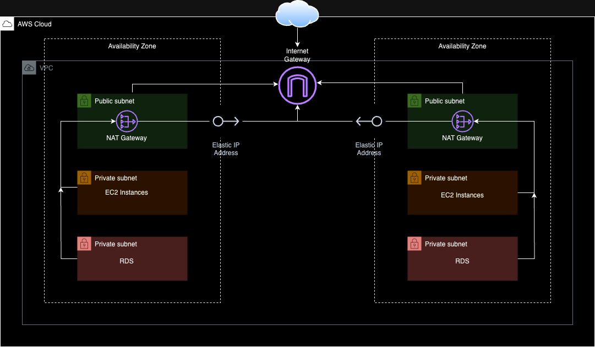

# **Building a 3-Tier AWS VPC Architecture Using Terraform**

## **Introduction**

In this project, we’ll dive into building a 3-tier AWS VPC architecture using Terraform. This architecture demonstrates how to span resources across multiple Availability Zones (AZs), create both public and private subnets, and configure NAT Gateways to enable secure internet access (e.g downloading software updates) for instances in private subnets via the Internet Gateway.

---

### **Prerequisites**

1. **AWS Account**: Active AWS account with permissions to create resources like VPCs, subnets, and EC2 instances.
2. **Terraform Installed**: Install Terraform from the [official website](https://www.terraform.io/downloads.html).
3. **AWS CLI Configured**

---

### **Note on Costs**

Deploying this architecture will incur AWS costs, even when using free-tier eligible resources, due to the following:

- **Elastic IPs**: Costs associated with each NAT Gateway.
- **NAT Gateways**: Charges for usage and data transfer.

**Tip**: Use the [AWS Pricing Calculator](https://calculator.aws/) to estimate costs.

### **Project Steps**

Here’s a breakdown of how the 3-tier AWS VPC architecture was created.

#### **Create the Network Infrastructure**

- A **VPC** was set up with a CIDR block of `10.0.0.0/16` to host all the resources.
- **Public subnets** were created in two Availability Zones (AZs) to host NAT Gateways and allow public-facing resources to access the internet.
- **Private subnets** were configured:
  - **Application subnets** to host the application instances.
  - **Database subnets** for securely hosting database instances.
- An **Internet Gateway** was attached to the VPC to provide internet connectivity for resources in public subnets.
- **NAT Gateways** were deployed in the public subnets to enable secure internet access for private subnets. Allowing both application and database instances to download software updates and libraries from the internet.
- **Route tables** were created and associated with the subnets:
  - Public subnets routed traffic directly through the Internet Gateway.
  - Private subnets routed outbound traffic through the NAT Gateways.

- **Destroy the Infrastructure**:
   - Clean up all resources created during the deployment.

---

## **Infrastructure Design**

The architecture for this Terraform project is illustrated below:



---

## **Usage**

1. Clone the repository:
   ```bash
   git clone https://github.com/bokal2/terraform-projects.git
   cd terraform-projects/3-tier-architecture
   ```

2. Initialize Terraform:
   ```bash
   terraform init
   ```

3. Plan the deployment:
   ```bash
   terraform plan
   ```

4. Apply the configuration:
   ```bash
   terraform apply
   ```

5. Verify the deployment:
   - Access AWS console and confirm if all the resources are created as expected.

6. Destroy the resources when no longer needed:
   ```bash
   terraform destroy
   ```
